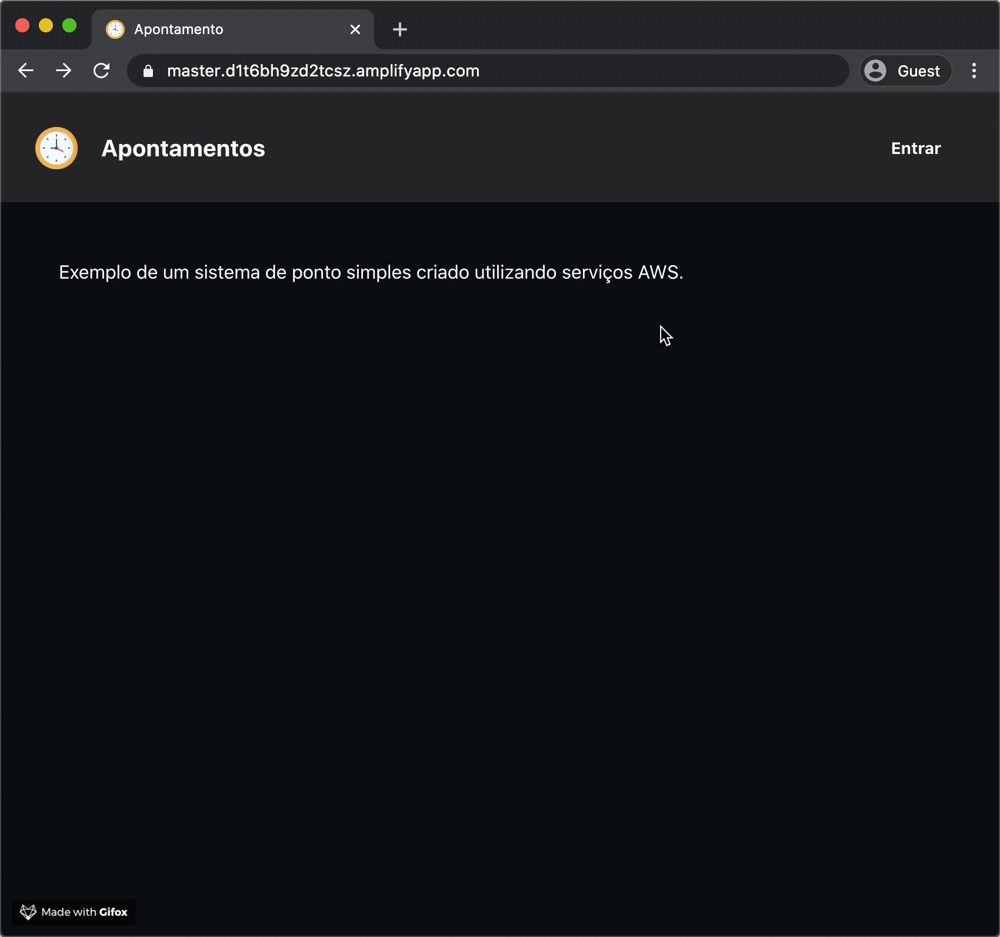
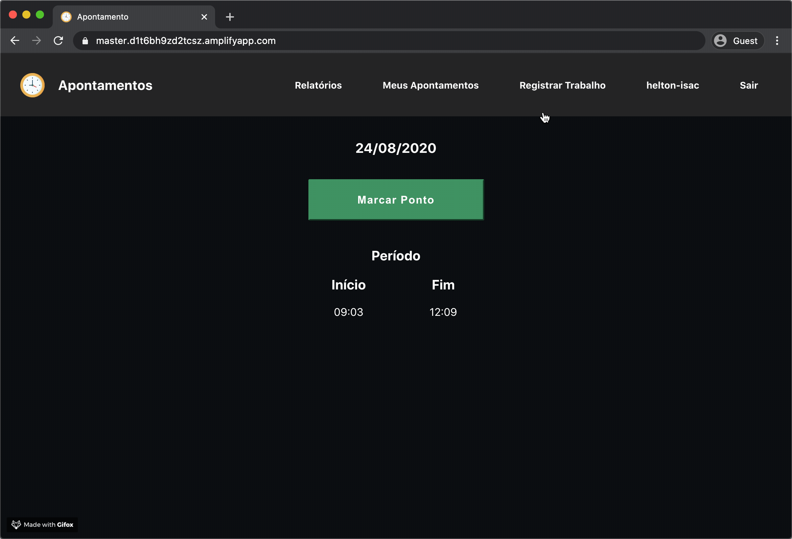
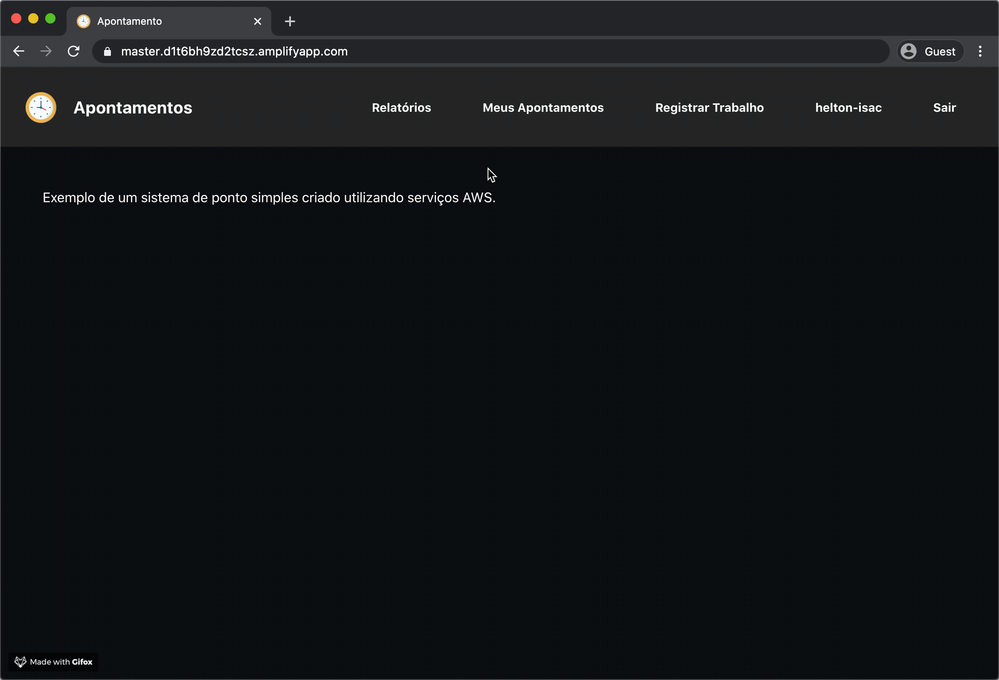
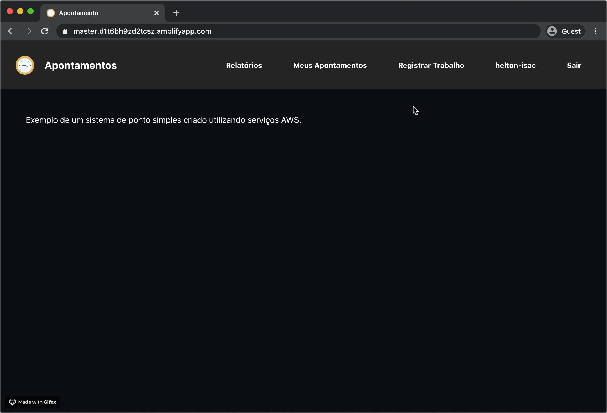

# Overview
Projeto criado como Trabalho final da matéria Cloud Foundation do MBA da FIAP para demonstrar o uso de alguns serviços Cloud.

 
 
 

# Tecnologias

Nesse projeto foram utilizadas as seguintes tecnologias:

* ReactJS
* AWS - Amplify
* AWS - Cognito
* AWS - DynamoDB
* AWS - Lambda
* AWS - API Gateway

 
 
 

# React
Utilizei React por já ter experiência com o React Native e achei que a forma de trabalhar é muito parecida, mas preciso me aprofundar nas especificidades de um ambiente WEB.
O Layout foi inspirado em outros sites pois o foco do trabalho era Cloud.

 
 
 

# Amplify
O Amplify foi utilizado para cuidar do Continuous deploy do app. Ele é responsável por:
* Provisionar um ambiente docker
* Fazer o Build do projeto
* Testar (quando configurado, não é o caso desse projeto)
* Fazer o deploy da app no ambiente
* Verificar o acesso e gerar alguns prints do front end para análise

 
 
 

# Cognito

O Login foi realizado utilizando o Cognito para a criação e autenticação do usuário.

A Hosted UI também foi customizada para se aproximar da UI Criada para o projeto.
 
 
 

 
 
 

# DynamoDB
Criei apenas duas tabelas NoSQL para este projeto:

    employee
        - login: String
        - role: String
    
    time_entries
        - login : String
        - date : String
        - entries : [{
            dateId: Int
            start: Date
            end: Date
        }]

Dessa forma é possível realizar o apontamento em pares e verificar.

 
 
 

# Lambda
A função lambda criada para acessar o banco de dados, foi criada utilizando o bluePrint: 

**microservice-http-endpoint**

    A simple backend (read/write to DynamoDB) with a RESTful API endpoint using Amazon API Gateway. 
    - nodejs · api-gateway

E a função utilizada foi essa:
    const AWS = require('aws-sdk');

    const dynamo = new AWS.DynamoDB.DocumentClient();

    /**
    * Demonstrates a simple HTTP endpoint using API Gateway. You have full
    * access to the request and response payload, including headers and
    * status code.
    *
    * To scan a DynamoDB table, make a GET request with the TableName as a
    * query string parameter. To put, update, or delete an item, make a POST,
    * PUT, or DELETE request respectively, passing in the payload to the
    * DynamoDB API as a JSON body.
    */
    exports.handler = async (event, context) => {
        console.log('Received event:', JSON.stringify(event, null, 2));

        let body;
        let statusCode = '200';
        const headers = {
            'Content-Type': 'application/json',
            'Access-Control-Allow-Origin': '*',
        };

        try {
            switch (event.httpMethod) {
                case 'DELETE':
                    body = await dynamo.delete(JSON.parse(event.body)).promise();
                    break;
                case 'GET':
                    body = await dynamo.scan({ TableName: event.queryStringParameters.TableName }).promise();
                    break;
                case 'POST':
                    body = await dynamo.put(JSON.parse(event.body)).promise();
                    break;
                case 'PUT':
                    body = await dynamo.update(JSON.parse(event.body)).promise();
                    break;
                default:
                    throw new Error(`Unsupported method "${event.httpMethod}"`);
            }
        } catch (err) {
            statusCode = '400';
            body = err.message;
        } finally {
            body = JSON.stringify(body);
        }

        return {
            statusCode,
            body,
            headers,
        };
    };

 
 
 

# API Gateway
No API Gateway precisei habilitar o CORS, já que minha api estava sendo acessada diretamente pelo browser e possuia os seguintes métodos: GET, POST, PUT, OPTION.

 
 
 

# Considerações finais
Sem dúvida a parte mais complexa foi entender e resolver os problemas ligado ao CORS. 

Para usuários com a role 'admin' ainda é exibida uma aba de relatórios onde é possível ver o apontamento de todos os usuários cadastrados no sistema.

O filtro foi feito local utilizando React, por isso ficou bem rápido para a quantidade de dados dos testes.

 
 

 
 
O componente react-loader-spinner foi utilizado e teve um resultado bem bonito na UI.
 
 

 
 
 
 
 

 
 

Ícones feitos por <a href="http://www.freepik.com/" title="Freepik">Freepik</a> from <a href="https://www.flaticon.com/br/"
title="Flaticon">www.flaticon.com</a>

